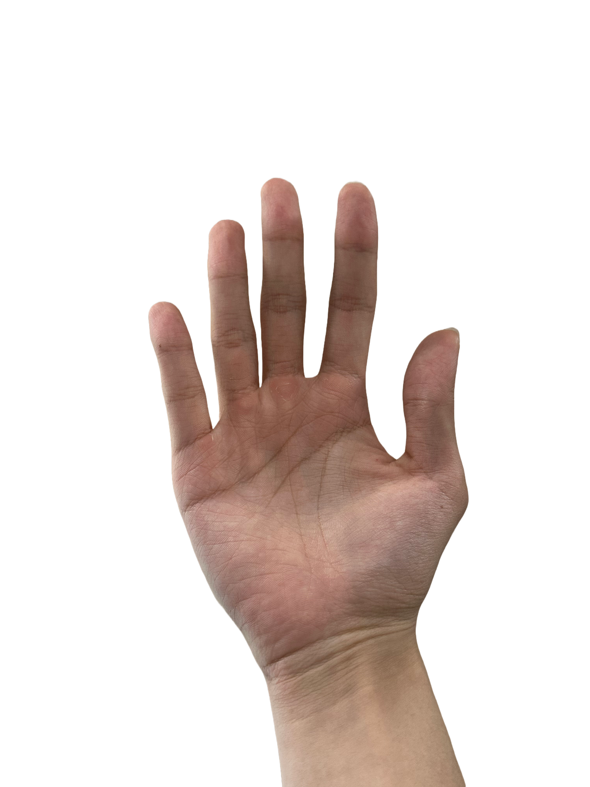
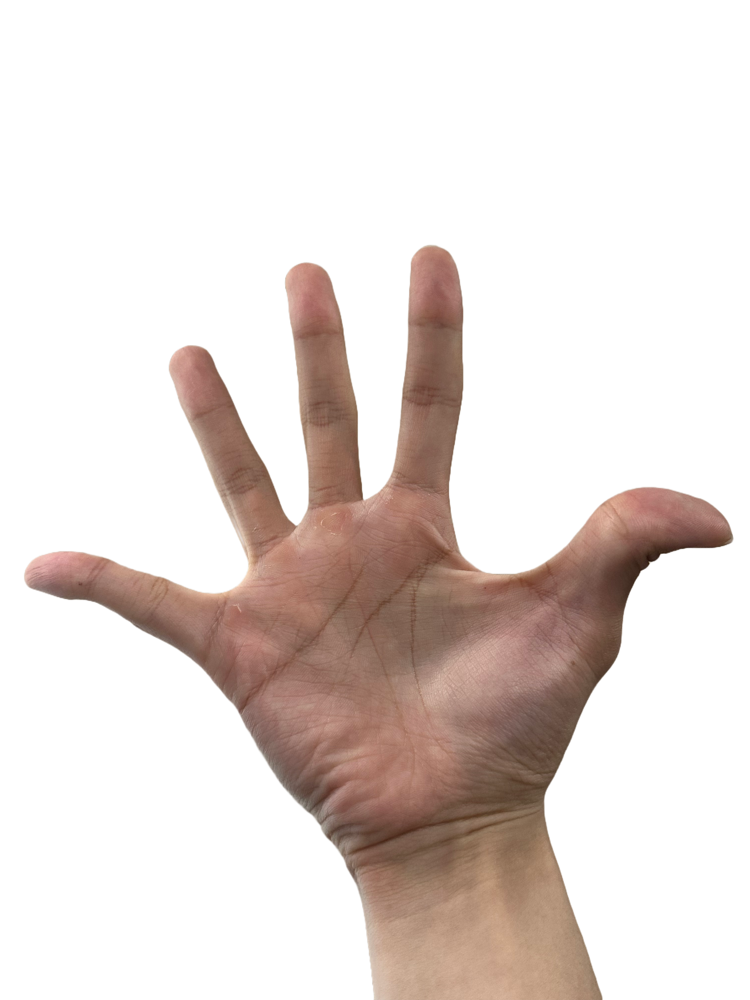
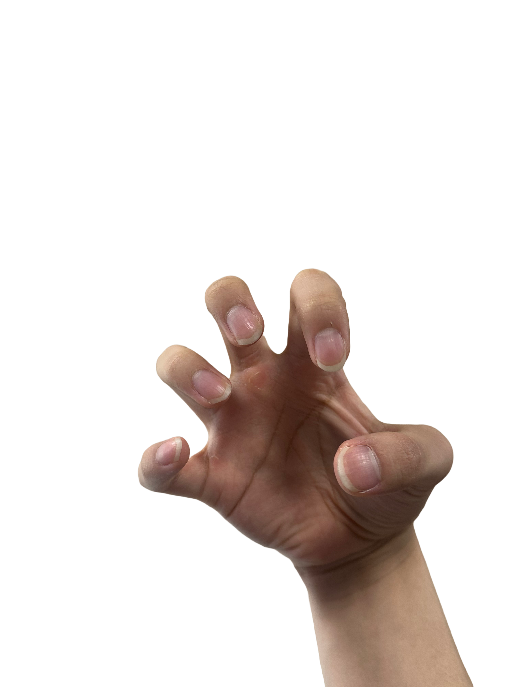

## Hand_Tracking


- Package for the **Tocabi hand control** with **Vive Focus vision-based hand tracking**.  
This repository implements algorithms to estimate and control finger joint angles (FE, AA) from hand-tracking data, and integrate them into the Tocabi robotic hand system.


---

## Getting Started

### Prerequisites
- **Windows OS** (configured for Windows development)
- **ROS 1** (tested with ROS Melodic/Noetic)
- **Python 2.x/3.x**
- **CMake** (minimum version 3.0.2)
- **Visual Studio** with C++17 support

### Required Dependencies

#### 1. **OpenCV 3.4.13**
This project uses OpenCV 3.4.13 for image processing and camera interface.
```bash
# Download and build OpenCV 3.4.13 for Windows
# Update the OpenCV_DIR path in CMakeLists.txt files to match your installation:
# - cam_node/CMakeLists.txt: set(OpenCV_DIR "C:/Users/dyros/cv/opencv-3.4.13/build")
# - vr/CMakeLists.txt: find_package(OpenCV REQUIRED NO_MODULE PATHS "C:/Users/dyros/cv/opencv-3.4.13/build")
```

#### 2. **vcpkg** (for Ceres, glog, gflags)
The following libraries are required from vcpkg:
- `ceres:x64-windows`
- `glog:x64-windows`
- `gflags:x64-windows`

Install vcpkg and these packages, then update the paths in CMakeLists.txt to match your installation.

#### 3. **Vulkan SDK**
Vulkan SDK is required for rendering.
- Download from: https://vulkan.lunarg.com/
- Update `Vulkan_INCLUDE_DIR` and `Vulkan_LIBRARY` paths in CMakeLists.txt

#### 4. **Qt5**
Qt5 is required with the following modules:
- Qt5Core
- Qt5Gui
- Qt5Widgets

Install Qt5 and configure the paths in your CMake environment.


### Installation
```bash
# Clone the repository with all submodules (includes OpenXR providers)
git clone --recurse-submodules https://github.com/jhri626/Hand_Tracking.git
cd Hand_Tracking

# If you already cloned without submodules, initialize them:
# git submodule update --init --recursive

# Configure environment paths if needed
# Update CMakeLists.txt paths to match your system:
# - OpenCV_DIR
# - Ceres_DIR, glog_DIR, gflags_DIR
# - Vulkan_INCLUDE_DIR, Vulkan_LIBRARY
# - Qt5 installation path
```

### Building the Project

#### Using ROS 1 catkin
```bash
# Open Visual Studio Developer Command Prompt
# Navigate to workspace root
cd Hand_Tracking

# Build all packages
catkin_make

# Or build with catkin build (if catkin_tools is installed)
catkin build

# Or build specific package
catkin build --this vr
catkin build --this final
catkin build --this cam_node
catkin build --this point_recorder
catkin build --this vr_launch
```

### Running the System

#### 1. **Launch VR Hand Tracking**
```bash
roslaunch vr_launch vr_start.launch
```

#### 2. **Hand Calibration** (in separate terminal)
Run the calibration service **5 times** in different hand poses:
```bash
rosservice call /record_point "{}"
```

**Calibration Poses:**
Perform the following hand poses for calibration (repeat the service call for each pose):

| Pose 1: Neutral | Pose 2: Abduction | Pose 3: Flextion |
|:---:|:---:|:---:|
|  |  |  |

| Pose 4: Thumb | Pose 5: Spherical |
|:---:|:---:|
|  |  |

#### 3. **Run Final Processing Node** (in separate terminal)
```bash
rosrun final final_node.py
```

---

## Package Structure
- **vr**: Main VR hand tracking package with OpenXR integration, HMD initialization, hand joint tracking
- **final**: Robot hand control and neural network refinement with MLP for joint angle estimation
- **cam_node**: Camera interface for visual feedback via ROS camera publisher
- **point_recorder**: Hand calibration data collection with `/record_point` service for capturing calibration poses
- **vr_launch**: Launch files for the complete system

---

## Notes
- This project is configured for **Windows** development
- Requires a **Vive Focus** HMD with hand tracking enabled
- Real-time performance requires adequate GPU/CPU resources
